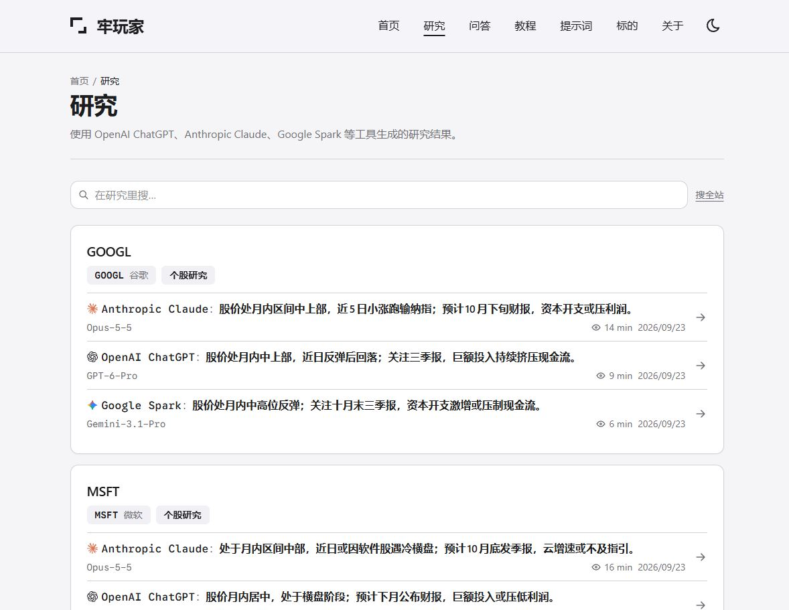
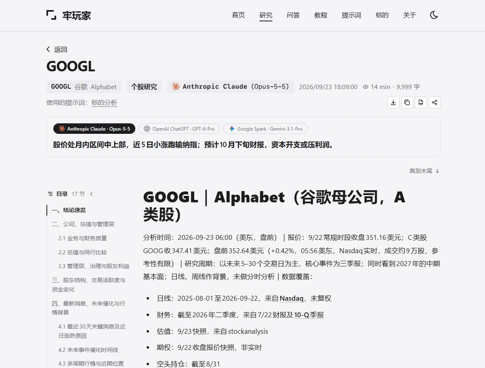

# 牢玩家 (Laowanjia)

[简体中文](README.md) | English

An AI agent–powered publishing system for US stock research. It publishes stock analyses, Q&A and prompts
generated by LLM agents such as ChatGPT, Claude and Gemini as a static website: write entries or import model
output in a local-only admin, attribute every entry to the agent and model that produced it, compare answers
from multiple agents side by side, and deploy to Cloudflare once the publish gate has validated the content.

Live example: [lwj.ai](https://lwj.ai/) (Chinese)

## Screenshots

Research list: reports on the same topic are grouped, each labeled with its agent and model.



Research detail: source attribution, switching between agents, table of contents and body.



## Features

**Content**

- Four content types: research (`/r`), Q&A (`/q`), guides (`/g`) and prompts (`/p`), plus standalone pages (`/a`)
- Source attribution: the AI agent and model behind every entry (ChatGPT, Claude, Gemini, Codex, …);
  human-written and unlabeled entries are displayed distinctly
- Multi-agent comparison: entries on the same question or topic are grouped and can be switched on the detail page
- Ticker index (`/s/<ticker>`, with a per-ticker RSS feed) and tag index (`/t/<tag>`)
- Prompt submissions: every contribution is attributed; anonymity must be stated explicitly

**Publishing**

- Keystatic admin, loaded only by the development server
- Model output import (`/_import`): creates a draft from JSON and validates it immediately
- Publish gate: schema constraints, a pre-commit hook and a build-time check block statements that disclose
  positions, cost basis, position size or credentials; the gate cannot be disabled
- Content check: blocks markup that would break page rendering or the admin editor
- Post text for X, Xueqiu and Futu, and image cards
- Batch cleanup by date range, with an automatic, verified backup first

**Site**

- Astro 7, AstroPaper and Tailwind 4; fully static output, no server
- Pagefind full-text search (works with Chinese), Open Graph images with CJK font subsetting,
  table of contents, dark mode
- Verbatim export: Markdown download, copy full text, print to PDF
- Sitemap, JSON-LD, RSS

## Quick start

Requirements: Node.js 22.12 or later, pnpm 9.

```bash
pnpm install
pnpm hooks:install
pnpm dev
```

- Site: <http://localhost:4321>
- Admin: <http://localhost:4321/keystatic>

The development server exposes endpoints that write to disk and run `git commit` / `push`.
Do not expose it to a network with `--host`.

## Configuration

| Location                | Contents                                                                    |
| ----------------------- | --------------------------------------------------------------------------- |
| `astro-paper.config.ts` | Domain, site name, author, social links (placeholders)                      |
| `src/data/`             | Agents and models, tags, tickers (also editable in the admin)               |
| `src/content/`          | Content (sample entries; safe to delete)                                    |
| `scripts/gate/rules.ts` | Publish gate rules; replace `internal_system` with your own systems' names  |
| `wrangler.jsonc`        | Cloudflare Worker configuration                                             |

## Publish gate

| Stage  | Location                   | What is checked                                          |
| ------ | -------------------------- | -------------------------------------------------------- |
| Schema | `src/content.config.ts`    | The schema has no fields for cost, size or direction     |
| Commit | pre-commit                 | Staged content about to be committed                     |
| Build  | first step of `pnpm build` | All content in the working tree; the build stops on failure |

Verdicts have three levels: `clean`, `warn` and `block`. A `block` has no override; the text must be changed.
The rules are pattern lists, so "no match" does not guarantee that nothing sensitive is present.
Design notes: [docs/gate.md](docs/gate.md).

**Keep the content repository private.** The commit and build stages run after content has entered the
repository, so the design holds only when nothing but the build output is public. Drafts are not blocked,
which likewise assumes a private repository.

## Deployment

The target is Cloudflare Workers Static Assets. The build command must be `pnpm build`; replacing it with
`astro build` skips the publish gate. See [docs/deploy.md](docs/deploy.md).

## Commands

| Command                      | Description                                                                |
| ---------------------------- | -------------------------------------------------------------------------- |
| `pnpm dev`                   | Development server and admin                                               |
| `pnpm build`                 | Publish gate → content check → tests → type check → build → search index   |
| `pnpm test`                  | Run all tests                                                              |
| `pnpm gate` / `gate:staged`  | Publish gate (working tree / staged changes)                               |
| `pnpm content:check`         | Content check                                                              |
| `pnpm content:import <file>` | Import model output as a draft                                             |
| `pnpm content:prune`         | Batch cleanup by date range (lists by default; `--yes` to delete)          |
| `pnpm admin`                 | Start the admin and verify that it works                                   |

## Project structure

```
src/content/      Content
src/data/         Registries
src/config/       Configuration and validation logic
src/dev/          Admin extensions and tool pages (development only)
scripts/gate/     Publish gate and tests
scripts/content/  Content check, import, cleanup
scripts/dev/      Admin launcher
docs/             Design documents
```

## Documentation

The design documents are written in Chinese.

- [docs/gate.md](docs/gate.md): publish gate
- [docs/content-model.md](docs/content-model.md): content model and registries
- [docs/release.md](docs/release.md): release process
- [docs/deploy.md](docs/deploy.md): deployment
- [docs/engineering-notes.md](docs/engineering-notes.md): development conventions and known issues

## Sample content

All entries under `src/content/` are fictional and exist only to demonstrate page layouts.
They contain no real prices, financial data or positions.

## Contributing

This repository is a one-way mirror. Pull requests are reviewed and re-implemented upstream, then published
with the next sync. See [CONTRIBUTING.md](CONTRIBUTING.md) (Chinese); report security issues privately as
described in [SECURITY.md](SECURITY.md).

## Disclaimer

This project is software and provides no investment services. Content published with it does not constitute
investment advice, trading guidance, an offer or a recommendation; the publisher is solely responsible for it.

## License

[MIT](LICENSE). Based on AstroPaper (MIT). Third-party components are listed in
[THIRD_PARTY_NOTICES.md](THIRD_PARTY_NOTICES.md); AI product logos belong to their respective owners.
