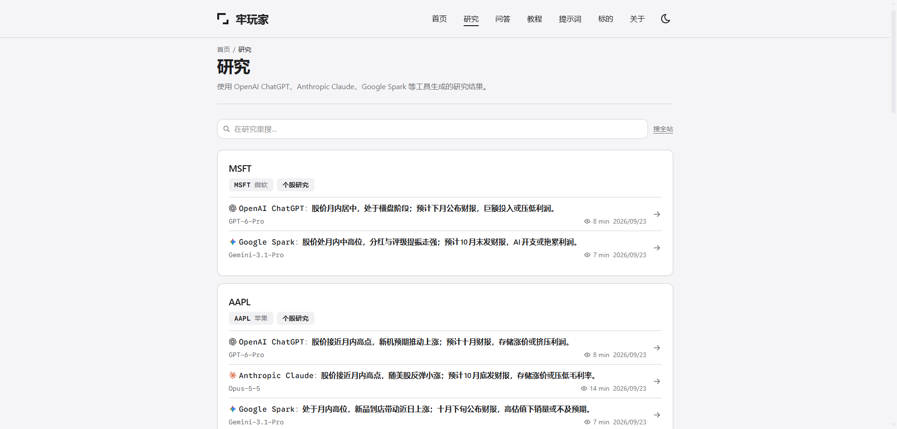
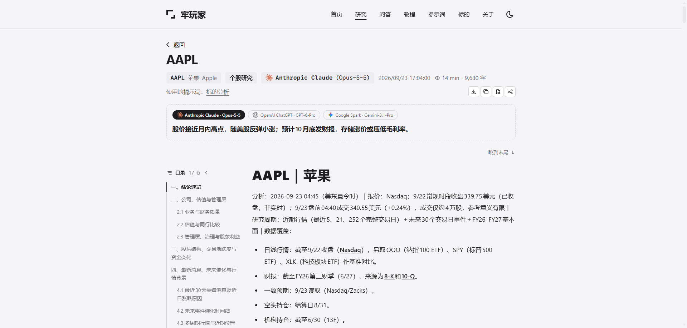

# 牢玩家

AI 美股研究发布系统。支持在本地后台撰写或导入模型输出，逐条标注来源（智能体与模型），
经发布闸校验后构建为静态站点，部署至 Cloudflare。

示例站点：[lwj.ai](https://lwj.ai/)

## 界面预览

研究列表：同一选题的多份研究归为一组，每条标注智能体与模型。



研究详情：来源标注、同题切换、目录与正文。



## 功能

**内容**

- 四类内容：研究（`/r`）、问答（`/q`）、教程（`/g`）、提示词（`/p`），另有单页（`/a`）
- 来源标注：记录智能体与模型；人工撰写、未标注分别显示
- 同题归组：同一问题或选题的多份内容合并展示，可在详情页切换
- 标的索引（`/s/<代码>`，含分标的 RSS）与标签索引（`/t/<标签>`）
- 提示词投稿：投稿须署名，匿名需显式注明

**发布**

- Keystatic 本地后台，仅在开发环境加载
- 模型输出导入（`/_import`）：由 JSON 生成草稿并即时校验
- 发布闸：schema 约束、pre-commit、构建期三级校验，拦截持仓、成本、数量、凭证类表述，不可关闭
- 稿件检查：拦截会导致页面渲染或后台编辑异常的写法
- 发帖文案（X、雪球、富途牛牛）与封面图生成
- 按时间批量清理，执行前自动备份并校验

**站点**

- Astro 7、AstroPaper、Tailwind 4，纯静态输出，无服务端
- Pagefind 全文搜索、Open Graph 分享图（中文按字取子集）、目录、深色模式
- 原文导出：Markdown 下载、复制全文、打印为 PDF
- sitemap、JSON-LD、RSS

## 快速开始

环境要求：Node.js 22.12 及以上，pnpm 9。

```bash
pnpm install
pnpm hooks:install
pnpm dev
```

- 站点：<http://localhost:4321>
- 后台：<http://localhost:4321/keystatic>

开发服务器提供可写盘、可执行 git 提交的接口，请勿通过 `--host` 暴露到网络。

## 配置

| 位置                    | 内容                                                  |
| ----------------------- | ----------------------------------------------------- |
| `astro-paper.config.ts` | 域名、站点名称、作者、社交链接（当前为占位值）        |
| `src/data/`             | 智能体与模型、标签、标的（亦可在后台编辑）            |
| `src/content/`          | 内容（当前为示例，可删除）                            |
| `scripts/gate/rules.ts` | 发布闸规则；`internal_system` 需替换为自有系统的名称  |
| `wrangler.jsonc`        | Cloudflare Worker 配置                                |

## 发布闸

| 阶段     | 位置                    | 校验对象                         |
| -------- | ----------------------- | -------------------------------- |
| 结构     | `src/content.config.ts` | schema 不含成本、数量、方向字段  |
| 提交     | pre-commit              | 暂存区中即将提交的内容           |
| 构建     | `pnpm build` 第一步     | 工作区全部内容；未通过则终止构建 |

判定分三级：`clean` / `warn` / `block`。`block` 无放行机制，只能修改文案。
规则基于词表，"未命中"不代表不存在泄露。设计说明见 [docs/gate.md](docs/gate.md)。

**内容仓库须保持私有。** 第二、三级校验均发生在内容进入仓库之后，该设计仅在公开范围限于构建产物时成立；
草稿不参与拦截，同样以仓库私有为前提。

## 部署

部署目标为 Cloudflare Workers Static Assets。构建命令须为 `pnpm build`，
替换为 `astro build` 会跳过发布闸。详见 [docs/deploy.md](docs/deploy.md)。

## 命令

| 命令                         | 说明                                                      |
| ---------------------------- | --------------------------------------------------------- |
| `pnpm dev`                   | 开发服务器与后台                                          |
| `pnpm build`                 | 发布闸 → 稿件检查 → 测试 → 类型检查 → 构建 → 搜索索引     |
| `pnpm test`                  | 运行全部测试                                              |
| `pnpm gate` / `gate:staged`  | 发布闸（工作区 / 暂存区）                                 |
| `pnpm content:check`         | 稿件检查                                                  |
| `pnpm content:import <文件>` | 将模型输出导入为草稿                                      |
| `pnpm content:prune`         | 按时间批量清理（默认仅列出，`--yes` 执行）                |
| `pnpm admin`                 | 启动后台并检查其可用性                                    |

## 目录结构

```
src/content/      内容
src/data/         登记数据
src/config/       配置与判定逻辑
src/dev/          后台扩展与工具页（仅开发环境）
scripts/gate/     发布闸与测试
scripts/content/  稿件检查、导入、清理
scripts/dev/      后台启动脚本
docs/             设计文档
```

## 文档

- [docs/gate.md](docs/gate.md)：发布闸
- [docs/content-model.md](docs/content-model.md)：内容模型与登记表
- [docs/release.md](docs/release.md)：发版流程
- [docs/deploy.md](docs/deploy.md)：部署
- [docs/engineering-notes.md](docs/engineering-notes.md)：开发约定与已知问题

## 示例内容

`src/content/` 下的内容均为虚构，仅用于展示页面结构，不含真实价格、财务数据或持仓信息。

## 参与贡献

本仓库为单向镜像，Pull Request 经审阅后在上游重新实现，随下次同步发布。
详见 [CONTRIBUTING.md](CONTRIBUTING.md)；安全问题请按 [SECURITY.md](SECURITY.md) 私下报告。

## 免责声明

本项目为软件，不提供任何投资服务。使用本项目发布的内容不构成任何投资建议、操作指导、要约或推荐，
由发布者自行负责。

## 许可

[MIT](LICENSE)。基于 AstroPaper（MIT）。第三方组件见 [THIRD_PARTY_NOTICES.md](THIRD_PARTY_NOTICES.md)；
文中涉及的 AI 产品标识归其各自所有者所有。
